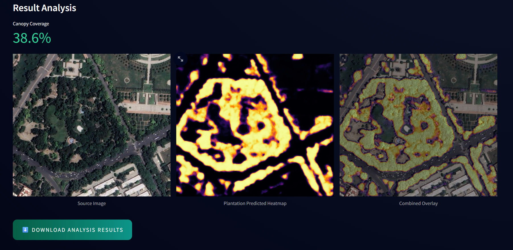

# GreenView-AI

Autonomous urban vegetation segmentation from RGB satellite images (no NIR or NDVI needed)

Live demo → [Hugging Face Space](https://huggingface.co/spaces/As-im/GreenView-AI)
### Dashboard View  


This project detects trees, shrubs, and green areas in urban Indian settings using only standard RGB satellite images (like Google Earth screenshots). It tackles cases where simple color detection fails.

### Challenges Faced
- Public datasets like LoveDA (mostly Chinese scenes) show domain shift to Indian cities, with lazy annotations (missed individual trees, included barren land/water in forests).
- RGB-only input creates the "green trap" - confusing green roofs, algae, or astroturf with real vegetation.
- Small custom dataset (87 images) risked overfitting.
- No reliable live satellite API fetching due to inconsistencies, preprocessing issues, and limits.

### Approach
1. Model: U-Net++ with ResNet34 encoder (segmentation_models_pytorch).
2. Training in 3 phases to prevent forgetting:
   - Warmup (5 epochs): Decoder-only on LoveDA.
   - General (15 epochs): Full model on LoveDA.
   - Adapt (15 epochs): Fine-tuning on mixed LoveDA + custom data.
3. Loss: 2*Tversky + 0.5*BCE (helped prevent overfitting compared to earlier Dice+BCE attempts).
4. Custom dataset: 87 manually annotated 512x512 patches from Connaught Place, New Delhi (using CVAT for annotation, Google Earth Pro for imagery download).
5. Deployment: Streamlit app on Hugging Face Spaces.

[Download custom dataset on Kaggle](https://www.kaggle.com/datasets/asim3000/satellite-imagery-urban-tree-segmentation-india)

### Training Results
Detailed metrics and observations → [results/training_summary.md](results/training_summary.md)  
Raw log → [results/raw_training_log.txt](results/raw_training_log.txt)

Key: Delhi val IoU improved from ~0.43 to 0.6412 after fine-tuning. LoveDA val fluctuated around 0.4 due to mislabeling - model often generated better masks than ground truth (detected missed trees).

## How to Use the Demo
1. Open the app.
2. Use the map to find an area.
3. Take a screenshot.
4. Upload and click GENERATE MASK.

Output: Confidence heatmap (warm colors = high vegetation probability), not binary mask.

Why manual upload? Avoids API inconsistencies and gives control over exact imagery.

### Result Example


What I Learned

-Domain adaptation with small targeted data gives noticeable gains.
-Visual checks showed model outperforming LoveDA labels in some cases.

### How to Run Locally
```bash
git clone https://github.com/Asim-dev-web/GreenView-AI.git
cd GreenView-AI
pip install -r requirements.txt
streamlit run app.py
